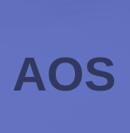

  <h1>Asociația de Terapie Ocupațională Speranța 2010</h1>

  <h2> <a href='https://asociatiasperanta2010.ro/'>https://asociatiasperanta2010.ro </a> </h2>

 
 

This site was created for a non-profit organization who takes care of people with disabilities. The participants spend a good part of their time trying to create various objects from recyclable materials.
 Please visit the site if you would like to learn more about them! 

<h1 align="center">Technologies</h2>

  
  
  
  
  
  
  

  
 
 

